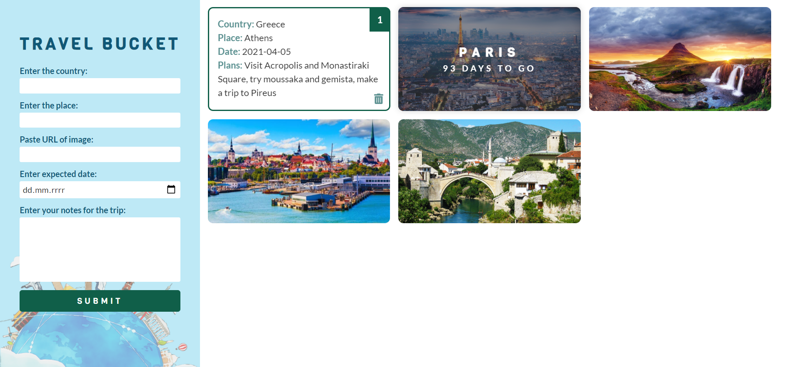

# TRAVEL BUCKET WEB APP

## Table of contents
* [General info and instructions](#general-info-and-instructions)
* [Screenshots](#screenshots)
* [Technologies](#technologies)
* [Features](#features)
* [TODOs](#TODOs)
* [Status](#status)
* [Inspiration](#inspiration)
* [Authors](#authors)

## General info and instructions
Do you like travelling? Are you planning your trips? Do you have bad memory?  
Then the **Travel Bucket Web App** is a perfect helper for you!  
### Follow the instructions:  
**Step 1:** Pick a country  
**Step 2:** Pick your destination  
**Step 3:** Find a JPG image and paste the URL  
**Step 4:** Pick a date  
**Step 5:** Write your notes or plans  
**Step 6:** Submit  
**Step 7:** ...and you have one card in your bucket!  

You can add as many cards you want. When you hover over the card you will see the destination and how many left to make the trip. Click on the card to flip it and see details of your trip you entered in the form.
You cancelled your trip? No problem! Click on the remove icon on the card back side and card will be removed.
Don´t worry you will lose your plans! Thanks to JSON you will see your cards whenever you reload or open again the page.

## Screenshots

## Technologies
* HTML5, CSS3 (Grid, Flexbox, Variables, Media Queries)  
* Javascript (OOP, Ternary Operator, Conditions, DOM)
* JSON
* LocalStorage

## Features
* Track your travel plans
* Check remaining days till your trip
* Reload or open again the page and the cards are still there
* Remove your trip (card) 

## TODOs
* Be able to edit the cards

## Status
Project is:  _in progress_

## Inspiration
This project is a result of great team work :)
I wanted to practise OOP in Javascript and I was bored to do a classic TODO list. So I had to find something to inspire me. Travelling and team work are two of those things. Thanks for cooperation to my partner!

## Authors
### [Alex](https://github.com/Ntelikatos) & [Evita](https://github.com/Evita-M)

